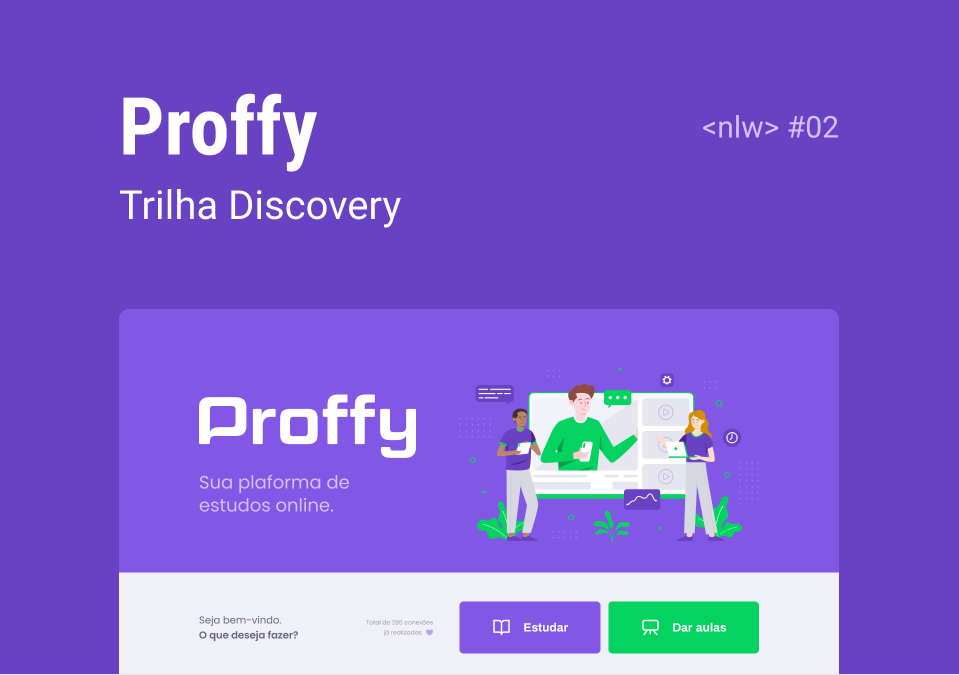

<div align="center">
    <h1>:book: Proffy</h1>
    <p>A sua plataforma de estudos online.</p>
    
</div>


## :scroll: Sobre o projeto

O Proffy é uma plataforma de estudos online criada durante o Next Level Week #2. O NLW é um evento disponibilizado pela rocketseat que visa levar os devs para um próximo nível.


## :artificial_satellite: Tecnologias

Para desenvolver este projeto utilizamos as seguintes tecnologias:

- ReactJS - Front-End
    - Typescript

    - React Router Dom

- NodeJS - Back-End

- React Native - Mobile


## :rocket: Utilização

**Você pode acessar esta plataforma clicando [aqui](https://proffy-app.netlify.app/).**

ou

### Rodar projeto localmente

#### Front-End - Web

1. Clone este repositório com ```git clone https://github.com/jefferson-calmon/proffy.git```

1. Acesse a pasta do projeto com ```cd proffy```

1. Instale as dependências do projeto com ```npm install``` ou ```yarn install```

1. Inicie o projeto com ````npm start``` ou ```yarn start```

5. Caso não abra um página web em seu navegador, acesse ```http://localhost:3000```


## Back-End

1. Se você não clonou este respositório ainda, clone ele seguindo o 1° passo do front-end.

1. Acesse a pasta ```server```

1. Rode ```npm install``` ou ```yarn install``` para instalar as dependências do projeto.

1. Rode ```npm knex:migrate``` ou ```yarn knex:migrate``` para criar o banco de dados.

1. Instale 

1. Inicie o projeto com ``````


## :technologist: Dev

Jovem apaixonado por programação e desenvolvimento, Jefferson ferrari é um desenvolvedor front-end.


[Portfólio](https://jefferson-calmon.github.io)

[Linkedin](https://www.linkedin.com/in/jefferson-f-b24248191/)

[Instagram](https://instagram.com/jeffz1_)

---

Build with :heart: